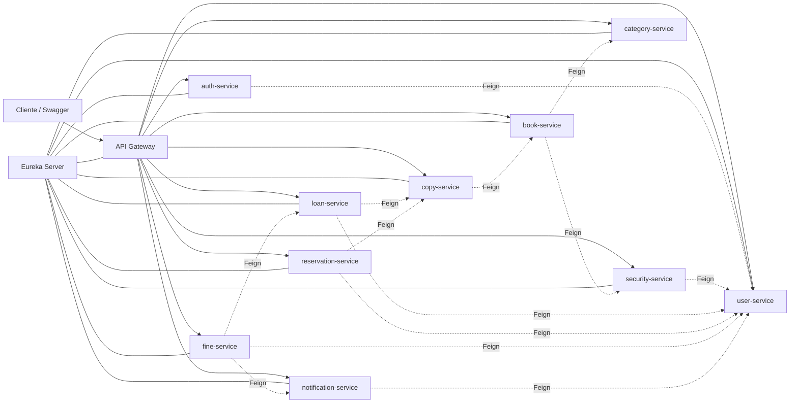

# Arquitectura general

```mermaid
flowchart LR
    C[Cliente / Swagger] --> G[API Gateway]
    G --> U[user-service]
    G --> A[auth-service]
    G --> S[security-service]
    G --> CA[category-service]
    G --> B[book-service]
    G --> CO[copy-service]
    G --> L[loan-service]
    G --> R[reservation-service]
    G --> F[fine-service]
    G --> N[notification-service]

    E[Eureka Server] --- G
    E --- U
    E --- A
    E --- S
    E --- CA
    E --- B
    E --- CO
    E --- L
    E --- R
    E --- F
    E --- N

    A -. Feign .-> U
    S -. Feign .-> U
    B -. Feign .-> CA
    B -. Feign .-> S
    CO -. Feign .-> B
    L -. Feign .-> U
    L -. Feign .-> CO
    R -. Feign .-> U
    R -. Feign .-> CO
    F -. Feign .-> U
    F -. Feign .-> L
    F -. Feign .-> N
    N -. Feign .-> U
```

Cada microservicio persistente conserva su propia base MySQL.
